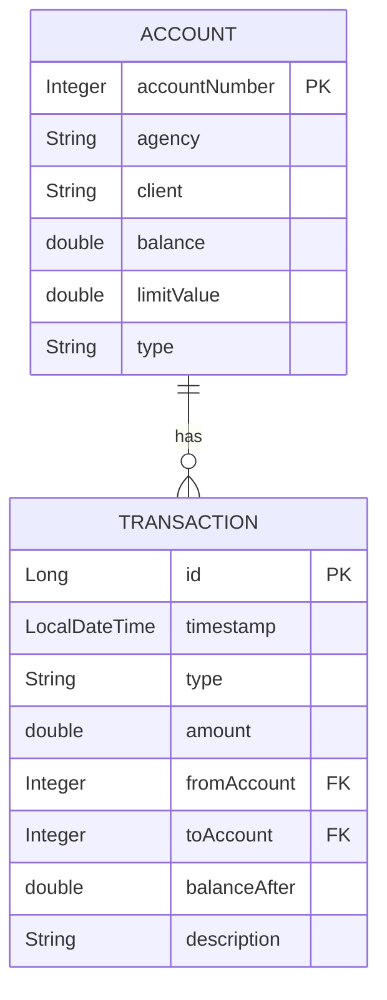

# AppBanco (REST)

Projeto exemplo de uma API bancária em Spring Boot com documentação OpenAPI (Swagger) e persistência via H2 (file-based). O objetivo deste repositório é expor operações bancárias (criação de conta, login, depósito, saque, transferência, alteração de limite, exportação de transações) para consumo por frontends ou times consumidores.

**Estrutura do projeto**
- `pom.xml` — configuração Maven.
- `src/main/java` — código-fonte (pacotes: `app`, `service`, `persistence`, `model`, `util`).
- `src/main/resources` — `application.properties` e demais recursos.

**Pré-requisitos**
- Java 11 ou superior
- Maven 3.x

**Executando localmente**
1. No diretório do projeto:

```powershell
mvn -DskipTests spring-boot:run
```

2. Endpoints úteis (após iniciar):
- Swagger UI: `http://localhost:8080/swagger-ui/index.html`
- H2 Console: `http://localhost:8080/h2-console` (JDBC URL: `jdbc:h2:file:./data/appbanco-db;DB_CLOSE_ON_EXIT=FALSE`, usuário `sa`, senha vazia)

**Formato de erro padrão**
Respostas de erro seguem um formato consistente. Exemplo de validação com múltiplos erros:

```json
{
  "code": "INVALID_REQUEST",
  "message": "Validation failed",
  "errors": [
    { "field": "agency", "message": "Agency deve conter apenas números" },
    { "field": "initialDeposit", "message": "Initial deposit deve ser um número" }
  ]
}
```

- Quando o erro envolver um valor enumerado (por exemplo o `type` da conta), a resposta pode incluir `validValues` com as opções aceitas.

**Endpoints principais**
- `POST /api/accounts` — criar conta
- `POST /api/auth/login` — login
- `POST /api/accounts/{id}/deposit` — depositar
- `POST /api/accounts/{id}/withdraw` — sacar
- `POST /api/transfer` — transferir
- `POST /api/accounts/{id}/change-limit` — alterar limite (validação: `newLimit` deve ser número > 0)
- `DELETE /api/accounts/{id}` — deletar conta (query param `password`)
- `GET /api/accounts` — listar contas
- `GET /api/transactions` — listar histórico de transferências (só `TRANSFER` e `TRANSFER_IN`)
- `GET /api/transactions/export` — exportar transferências como CSV (download `transfers.csv`)

Para detalhes de cada endpoint, parâmetros e exemplos, consulte o Swagger UI em tempo de execução.

**Diagrama de Componentes (Arquitetura)**

```mermaid
graph LR
  FE[Front-end / Cliente] -->|HTTP JSON| Controllers[Controllers (REST)]
  Controllers --> Services[Services (Bank, AuthService)]
  Services --> Persistence[PersistenceService / Repositories]
  Persistence --> H2[(H2 - arquivo ./data/appbanco-db)]
  Controllers -->|OpenAPI| Swagger[Swagger UI]
```

**Diagrama ER (entidades principais)**



**Sequência: Fluxo de uma Transferência**

```mermaid
sequenceDiagram
  participant FE as Front-end
  participant C as TransactionsController
  participant S as Bank (service)
  participant P as PersistenceService
  FE->>C: POST /api/transfer {fromAccount,toAccount,amount,password}
  C->>S: bank.transfer(from,to,amount,password)
  S->>S: valida regras (saldo, limite, horário)
  alt validação falha
    S-->>C: OperationResult.fail(...) (código + mensagens)
    C-->>FE: 4xx + corpo de erro
  else valida ok
    S->>aFrom: withdraw(amount)
    S->>aTo: deposit(amount)
    S->>P: saveOrUpdateAccount(aFrom)
    S->>P: saveOrUpdateAccount(aTo)
    S->>P: saveTransaction(t1); saveTransaction(t2)
    S-->>C: OperationResult.ok(...)
    C-->>FE: 200 OK (mensagem)
  end
```

**Glossário rápido de tipos de transação**
- `CREATE` — criação de conta (apenas histórico de criação)
- `DEPOSIT` — depósito
- `WITHDRAW` — saque
- `TRANSFER` — transferência (saída)
- `TRANSFER_IN` — transferência recebida (entrada)
- `LIMIT_CHANGE` — alteração de limite
- `DELETE` — exclusão de conta (registro histórico)


---

(Arquivo `README-fixed.md` criado contendo a mesma informação sem wrappers de código; renomeie para `README.md` localmente se preferir.)
