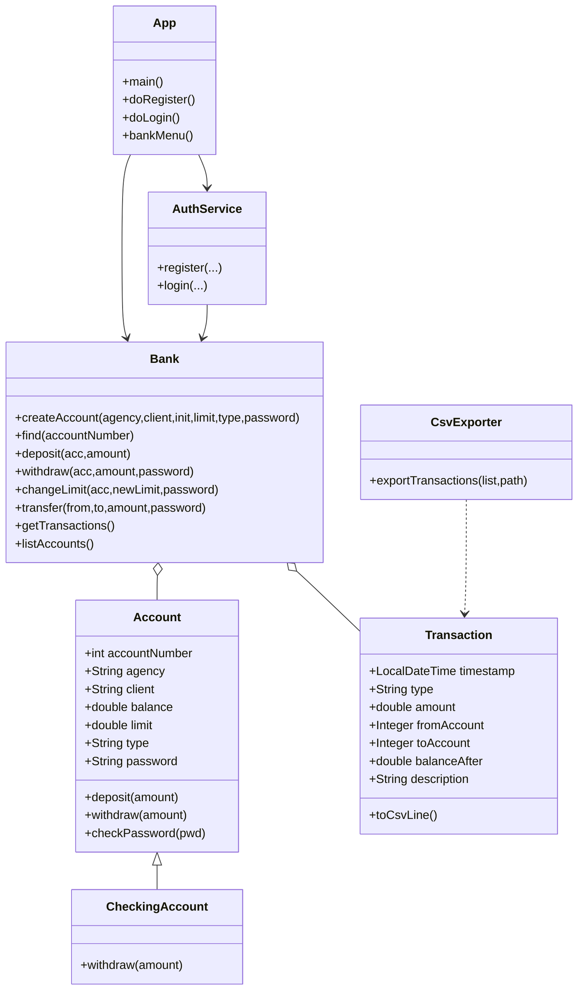
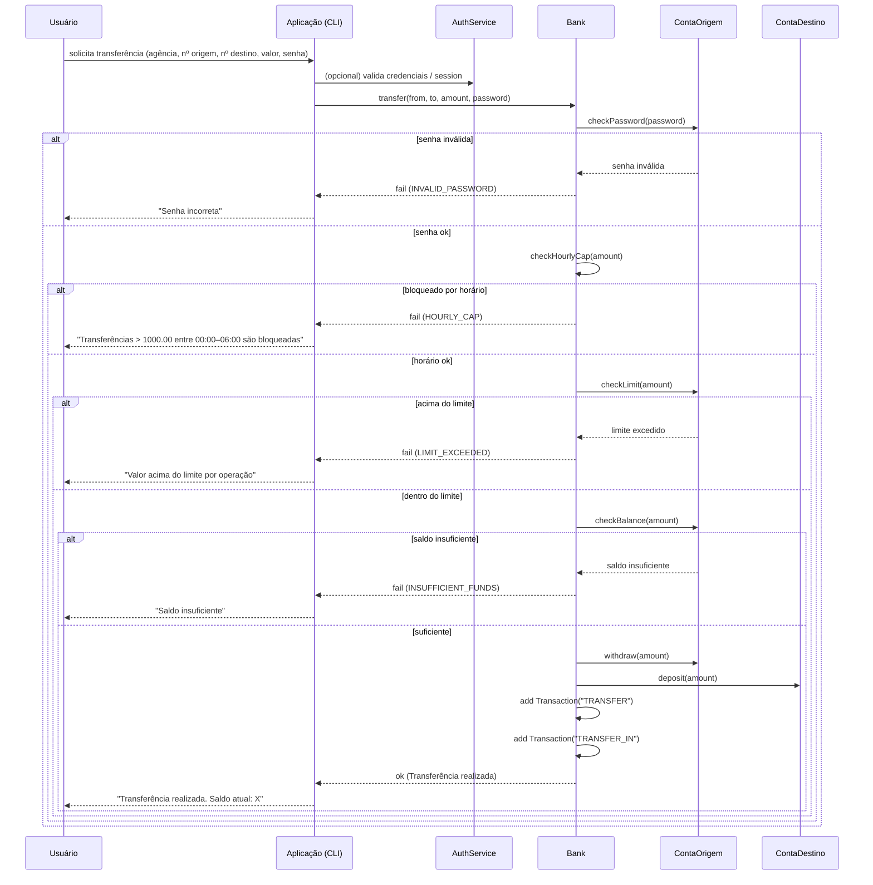

# AppBanco — Aplicação bancária (terminal)

Aplicação em Java que simula operações bancárias básicas via terminal. Projetada para ser um entregável didático com baixo acoplamento e fácil evolução.

------------------------------------------------------------

## Funcionalidades principais

- Cadastro de conta com: agência (numérica), tipo (Corrente / Poupança / Salário), nome do cliente, depósito inicial, limite e senha.
- Login por agência + número da conta.
- Depósito (não exige senha).
- Saque: exige senha; não permite saldo negativo; respeita limite por operação.
- Alteração de limite: exige senha.
- Transferência: exige senha; não permite auto-transferência; respeita limite e saldo; entre 00:00–06:00 bloqueia valores > R$1.000,00.
- Histórico de transações em memória e exportação para CSV.

------------------------------------------------------------

## Estrutura do projeto

- `src/app` — interface de linha de comando (`App.java`).
- `src/model` — entidades: `Account`, `CheckingAccount`, `Transaction`.
- `src/service` — lógica de domínio: `Bank`, `AuthService`.
- `src/util` — utilitários: `CsvExporter`, `OperationResult`.
- `bin` — saída de compilação (artefatos `.class`).

------------------------------------------------------------

## Como compilar e executar (Windows PowerShell)

1) Compilar todos os fontes:

```powershell
javac -d bin src\app\*.java src\model\*.java src\service\*.java src\util\*.java
```

2) Executar a aplicação:

```powershell
java -cp bin app.App
```

------------------------------------------------------------

## Uso rápido (fluxo)

1. Inicie a aplicação.
2. No menu inicial escolha `1` para cadastrar ou `2` para login.
3. Cadastro pede agência (somente números), tipo (1-3), cliente, depósito inicial, limite e senha.
4. Faça login com o número da conta criado.
5. No menu logado execute saque, depósito, transferência, alteração de limite ou exporte o histórico. Saque/transferência/alteração de limite pedem senha.
    - Ao escolher a opção de exportar (`5`) o histórico será salvo automaticamente no arquivo `transactions.csv` na pasta atual. Não é necessário informar o nome do arquivo. Se o arquivo já existir, ele será substituído.

Dicas rápidas de validação durante o uso:
- Agência: somente dígitos (no cadastro e no login).
- Cliente: nome deve conter letras (não é permitido apenas números).
- Depósito inicial / Limite: no cadastro aceitam somente números; o app re-prompta até receber um número válido.
- Nos fluxos de transferência, saque e ao digitar números de conta o app valida entradas numéricas e exibe mensagens claras em caso de erro.

------------------------------------------------------------

## Regras e validações importantes

- Agência: somente dígitos no cadastro.
- Senha: necessária para saque, alteração de limite e transferência.
- Saque: não permite saldo negativo — só é permitido se `valor <= saldo` e `valor <= limite`.
 - Transferência: não permite transferir para a própria conta; exige senha; verifica saldo e limite; entre 00:00 e 06:00 bloqueia transferências com valor > R$1.000,00.
 - Exportação: CSV com colunas (timestamp,type,amount,fromAccount,toAccount,balanceAfter,description).
     - Observação: o arquivo contém somente transações financeiras (depósitos, saques, transferências e alterações de limite). Eventos de criação de conta (`CREATE`) são excluídos do CSV.

Outras notas de implementação e comportamento:
- As operações do `Bank` retornam um `OperationResult` que contém `success` (boolean), `code` (string) e `message` (string). A camada de apresentação (`App`) exibe `message` ao usuário.
- Mensagens de erro específicas (exemplos): `INSUFFICIENT_FUNDS`, `LIMIT_EXCEEDED`, `INVALID_PASSWORD`, `HOURLY_CAP`, `ACCOUNT_NOT_FOUND`, `SAME_ACCOUNT`.
- Atualmente as senhas são armazenadas em texto simples na memória (campo `password` em `Account`). Recomendação: migrar para hashing (bcrypt) antes de usar em produção.

------------------------------------------------------------

## Diagrama de classes (Mermaid)



## Diagrama de sequência (Transferência)



------------------------------------------------------------