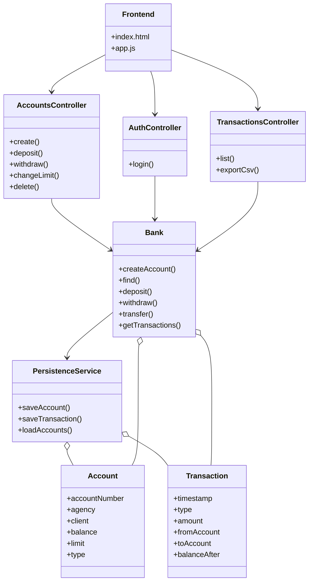
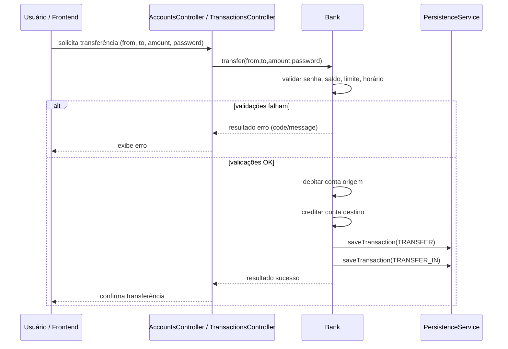

# AppBanco — Aplicação bancária

Aplicação didática em Java que implementa operações bancárias básicas e as expõe via endpoints REST para consumo por frontends. O repositório contém a versão original por CLI (v1.1.0) e a versão RESTful (Atual) com persistência JPA/Hibernate, documentação OpenAPI (Swagger) e deployment em cloud (Railway) usando PostgreSQL.

## Stack

- Java 11
- Spring Boot 2.7.12
- Maven 3.8.x+
- Swagger UI (documentação interativa)
- PostgreSQL 16 (Railway) / 14+ (local)
- Docker (multi-stage)
- Railway (deploy)

---

## Rápido (Quickstart)

Pré-requisitos principais (veja versões em "Stack")
- Java (JDK compatível)
- Maven
- PostgreSQL (local) — produção usa PostgreSQL 16 na Railway
- Docker (Opcional) 

Execução local (PostgreSQL)
1. Defina as variáveis de ambiente (exemplo padrão local):
  - `DB_HOST=127.0.0.1`
  - `DB_PORT=5432`
  - `DB_NAME=appbanco`
  - `DB_USER=postgres`
  - `DB_PASSWORD=postgres`
2. Rodar em desenvolvimento:

```powershell
mvn -DskipTests spring-boot:run
```

Gerar JAR e executar:

```powershell
mvn -DskipTests package
java -jar target\appbanco-1.0.0-SNAPSHOT.jar
```

Execução via Docker (build local)

```powershell
docker build -t appbanco:local .
docker run -e DB_HOST=host.docker.internal -e DB_PORT=5432 -e DB_NAME=appbanco -e DB_USER=postgres -e DB_PASSWORD=postgres -p 8080:8080 appbanco:local
```

URLs úteis (porta padrão `8080`)

**Execução Local:**
- Frontend estático: `http://localhost:8080/`
- Swagger UI (OpenAPI): `http://localhost:8080/swagger-ui/index.html`

**Deploy em Nuvem (Railway):**
- App/Frontend: `https://appbanco-production.up.railway.app/`
- Swagger UI: `https://appbanco-production.up.railway.app/swagger-ui/index.html`

---

## Funcionalidades principais

- Criar conta (agência, cliente, depósito inicial, limite, tipo, senha)
- Login por agência + número da conta
- Consultar contas
- Depósito
- Saque (requer senha)
- Alterar limite (requer senha)
- Transferência entre contas (requer senha; validações de saldo/limite; bloqueio horário para valores altos)
- Histórico de transações e exportação CSV
- Deletar a conta

---

## Estrutura rápida do código

- `src/main/java/app` — bootstrap e configuração OpenAPI
- `src/main/java/app/rest` — controllers e DTOs de request/response
- `src/main/java/service` — regras de negócio (`Bank`, `AuthService`)
- `src/main/java/persistence` — entidades JPA e `PersistenceService`
- `src/main/resources/static` — frontend estático (`index.html`, `app.js`, `styles.css`)
- `src/main/resources/application.properties` — configurações de datasource (PostgreSQL) e OpenAPI

---

## Endpoints principais

> Para documentação detalhada e exemplos interativos, abra o **Swagger UI** em execução.

| Método | Endpoint | Descrição |
|--------|----------|-----------|
| `POST` | `/api/accounts` | Criar conta |
| `POST` | `/api/auth/login` | Fazer login |
| `GET` | `/api/accounts` | Listar todas as contas |
| `POST` | `/api/accounts/{accountNumber}/deposit` | Depositar |
| `POST` | `/api/accounts/{accountNumber}/withdraw` | Sacar (requer senha) |
| `POST` | `/api/accounts/{accountNumber}/change-limit` | Alterar limite (requer senha) |
| `DELETE` | `/api/accounts/{accountNumber}` | Deletar conta |
| `POST` | `/api/transfer` | Transferência entre contas (requer senha) |
| `GET` | `/api/transactions` | Histórico de transações |
| `GET` | `/api/transactions/export` | Exportar histórico em CSV |

---

## Persistência

- Produção: PostgreSQL (Railway) — credenciais via variáveis de ambiente `DB_HOST`, `DB_PORT`, `DB_NAME`, `DB_USER`, `DB_PASSWORD`.
- Desenvolvimento local: PostgreSQL (recomendado) — use as mesmas variáveis acima apontando para sua instância local.
- Configuração base em `src/main/resources/application.properties`.

---

## Diagramas

Abaixo dois diagramas Mermaid que representam a arquitetura e o fluxo principal.

Diagrama de classes (Mermaid):



Diagrama de sequência (Transferência):

