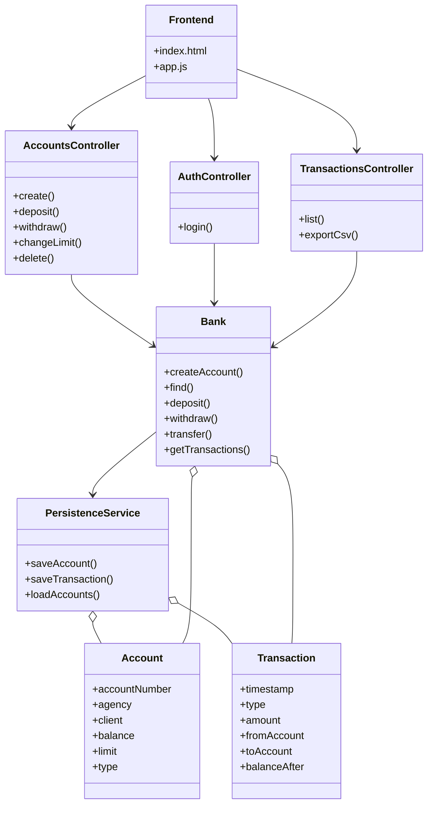
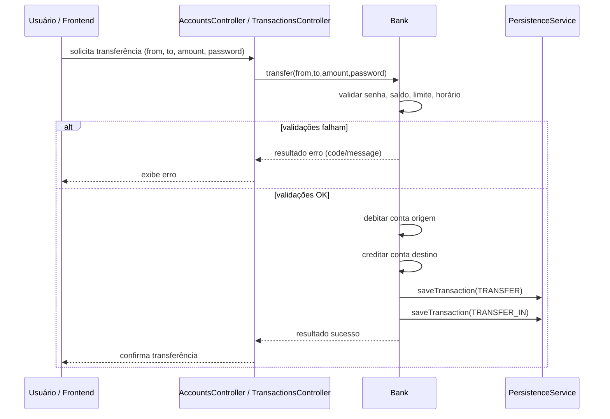

# AppBanco — Aplicação bancária

Aplicação didática em Java que implementa operações bancárias básicas e as expõe via endpoints REST para consumo por frontends. O repositório contém a versão original por CLI (v1.1.0) e a versão RESTful (Atual) com persistência JPA/Hibernate e documentação OpenAPI (Swagger).

---

## Rápido (Quickstart)

Pré-requisitos
- Java 11+
- Maven 3.x

Rodando em desenvolvimento (PowerShell):

```powershell
mvn -DskipTests spring-boot:run
```

Gerar JAR e executar:

```powershell
mvn -DskipTests package
java -jar target\\appbanco-1.0.0-SNAPSHOT.jar
```


URLs úteis (porta padrão `8080`)
- Frontend estático: `http://localhost:8080/`
- Swagger UI (OpenAPI): `http://localhost:8080/swagger-ui/index.html`
- H2 Console: `http://localhost:8080/h2-console` (JDBC URL: `jdbc:h2:file:./data/appbanco-db;DB_CLOSE_ON_EXIT=FALSE`, usuário `sa`, senha vazia)

---

## Frontend (curto)

Há um frontend estático pronto em `src/main/resources/static` (arquivos `index.html`, `app.js`, `styles.css`). Ao iniciar a aplicação, abra `http://localhost:8080/` para usar a interface — ela consome os endpoints sob `/api` e permite criar conta, fazer login, depositar, sacar, transferir, listar contas e exportar o histórico.

---

## Funcionalidades principais

- Criar conta (agência, cliente, depósito inicial, limite, tipo, senha)
- Login por agência + número da conta
- Consultar contas
- Depósito
- Saque (requer senha)
- Alterar limite (requer senha)
- Transferência entre contas (requer senha; validações de saldo/limite; bloqueio horário para valores altos)
- Histórico de transações e exportação CSV
- Deletar a conta
- Frontend estático para operações básicas

---

## Estrutura rápida do código

- `src/main/java/app` — bootstrap e configuração OpenAPI
- `src/main/java/app/rest` — controllers e DTOs de request/response
- `src/main/java/service` — regras de negócio (`Bank`, `AuthService`)
- `src/main/java/persistence` — entidades JPA e `PersistenceService`
- `src/main/resources/static` — frontend estático (`index.html`, `app.js`, `styles.css`)
- `src/main/resources/application.properties` — configurações (H2, JPA, etc.)

---

## Endpoints principais

> Para documentação detalhada e exemplos, abra o Swagger UI em execução.

- `POST /api/accounts` — Criar conta
  - Exemplo request:
```json
{ "agency":"001", "client":"João Silva", "initialDeposit":"100.0", "limit":"500.0", "type":"CORRENTE", "password":"senha123" }
```
- `POST /api/auth/login` — Login
  - `{ "agency":"001","accountNumber":"1001","password":"senha123" }`
- `GET /api/accounts` — Listar contas
- `POST /api/accounts/{accountNumber}/deposit` — Depositar `{ "amount": 100.0 }`
- `POST /api/accounts/{accountNumber}/withdraw` — Sacar `{ "amount": 50.0, "password": "senha" }`
- `POST /api/accounts/{accountNumber}/change-limit` — Alterar limite `{ "newLimit": "1500.0", "password": "senha" }`
- `DELETE /api/accounts/{accountNumber}?password=...` — Deletar conta
- `POST /api/transfer` — Transferência
  - `{ "fromAccount":1001, "toAccount":1002, "amount":250.0, "password":"senha123" }`
- `GET /api/transactions` — Histórico (REST retorna tipos relacionados a transfers)
- `GET /api/transactions/export` — Exportar CSV (download `transfers.csv`)

---

## Persistência e backup

- Banco em H2 (file) por padrão: arquivos em `data/` (ex.: `data/appbanco-db.mv.db`).
- Configuração em `src/main/resources/application.properties`.
- Para backup, copie os arquivos `data/appbanco-db.*` antes de remover a pasta `data/`.

---

## Testes manuais sugeridos

1. Criar duas contas via `POST /api/accounts` (usar Swagger ou curl).
2. Fazer login (`POST /api/auth/login`) para verificar retorno de dados.
3. Depositar e sacar em uma conta; verificar saldo retornado.
4. Realizar transferência entre contas; verificar histórico e exportar CSV.

---

## Diagramas

Abaixo dois diagramas Mermaid que representam a arquitetura e o fluxo principal.

Diagrama de classes (Mermaid):



Diagrama de sequência (Transferência):

